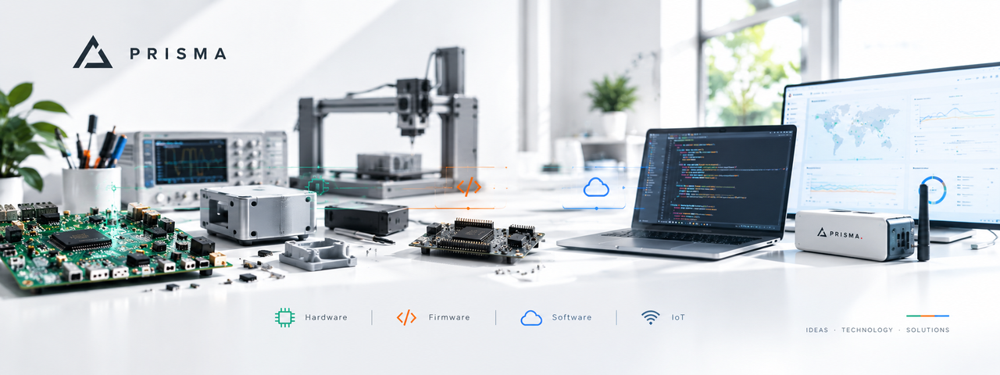
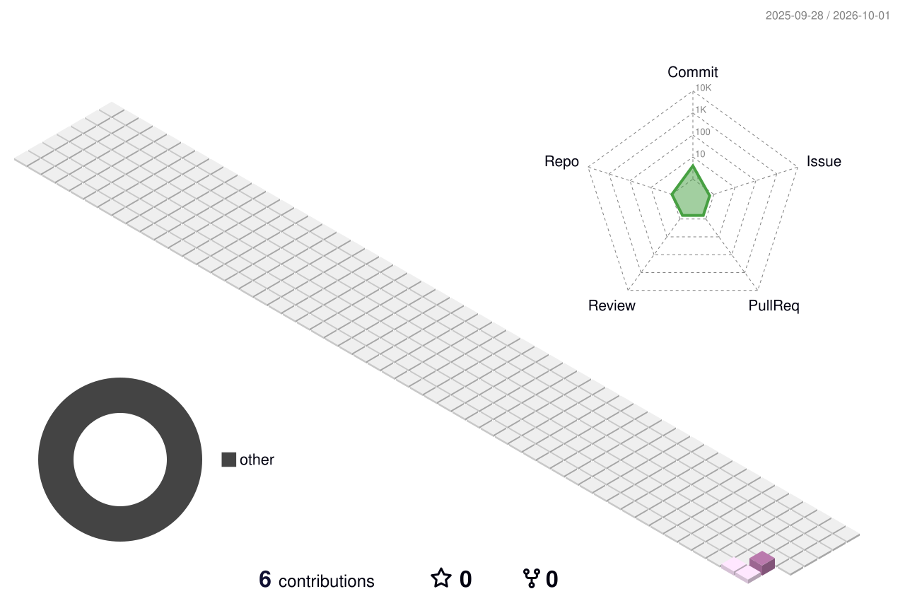

## Hi there :small_red_triangle:

⚡ Engineering Technology

🔧 Hardware • Firmware • Software • IoT
🌐 Backend • Frontend • APIs • Data
🧩 From concept to integrated solutions

🚀 PRISMA | Ideas. Technology. Solutions.

## Contacto

## Tecnologías más usadas

### Lenguajes

### Librerias y Frameworks 

### Otras...

## Trabajando...
